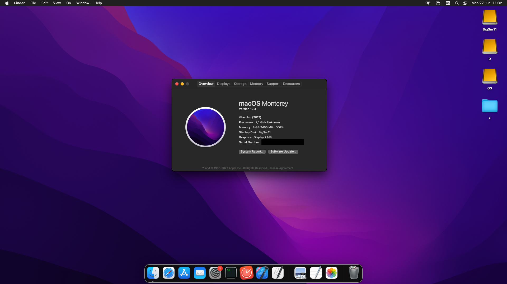
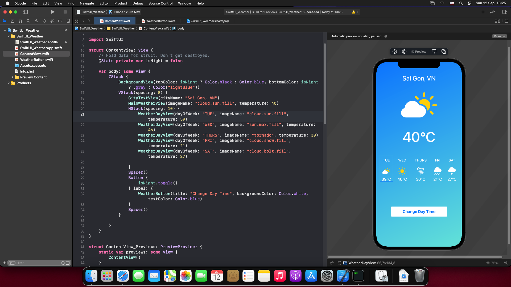

# OpenCore EFI for AMD Laptops (updated to Monterey 12.4)

**OpenCore version: update from 0.7.4 to [0.9.3](https://github.com/acidanthera/OpenCorePkg/releases/)**

**macOS: Monterey 12.4**



## Preparing

### SSDTs

**In this repository we dump ssdt on our device which maybe doesn't work on your system**

**If you got kernel panic please using [SSDTTime] (https://github.com/corpnewt/SSDTTime) to dump your SSDTs**

1. Start with option `P`. It dumps the current system's DSDT, which will be utilised in order to create these SSDTs and patches.
   - `FixHPET` (Choose option `C` which only patches conflicting IRQs from legacy devices)
   - `USBX` (choose the default option `B` key)
   - `RTCAWAC`
   - `PluginType`  
     **For AMD Laptop**
   - `FakeEC Laptop`
   - `PLNF`
   - `XOSI` (Choose default `A` key)
2. Copy all the files that start with SSDT and end in `*.aml` inside of Drive `/EFI/OC/ACPI`
3. Finally, merge `patches_OC.plist` by using the PatchMerge script included with SSDTTime. Run it the same way as SSDTTime

Or you can start the guide [here](https://nootinc.github.io/guide/gathering-files/acpi)

### Kext
- Replace WhateverGreen.kext with [Nootedred.kext](https://github.com/NootInc/NootedRed)
- Highly recommend using [itlwm.kext](https://github.com/OpenIntelWireless/itlwm/releases) with [HeliPort app](https://github.com/OpenIntelWireless/HeliPort/releases)
- MapUSB and replace UTBDefault.kext with UTBMap.kext

### config.plist [Setup](https://dortania.github.io/OpenCore-Install-Guide/AMD/zen.html#starting-point)
**remove `sample.plist`**  

**NVRAM**  
- boot-args: `-v keepsyms=1 debug=0x100 npci=0x2000 vsmcgen=1`  
- add `alcid=xx` replace `xx` with your layout-id 
- add `agdpmod=pikera` if you got black screen after boot

**PlatformInfo**
- Please change MLB/ROM/Serial Number/UUID by using [GenSMBIOS](https://github.com/corpnewt/GenSMBIOS)

## My laptop is **ASUS Vivobook A412D**
- CPU model: AMD RAMD Ryzen 5 3500U with Radeon (TM) Vega Graphics
- GPU model: Radeon (TM) Vega 8 Graphics
- Chipset Model:
- Keyboard, trackpad:
  - Keyboard: PS2
  - Trackpad: 
- Audio
  - AMD K17.1
  - Audio Codec: `xx`
- Network Controller models: Intel wireless 8265
- Drive Model:
## **Note**:
There's no audio and video supported, but I mainly use this Hackintosh for iOS development purpose, so not a big deal.
## Post-install

### What is working?
- 
### What is not working?
- 

## What's in the box?
```
├── EFI
│   ├── BOOT
│   │   └── BOOTx64.efi
│   └── OC
│       ├── ACPI
│       │   ├── SSDT-EC.aml
│       │   ├── SSDT-HPET.aml
│       │   ├── SSDT-PLUG-ALT.aml
│       │   ├── SSDT-PNLF.aml
│       │   ├── SSDT-USBX.aml
│       │   └── SSDT-XOSI.aml
│       ├── Bootstrap
│       │   └── Bootstrap.efi
│       ├── config.plist
│       ├── Drivers
│       │   ├── HfsPlus.efi
│       │   ├── OpenCanopy.efi
│       │   └── OpenRuntime.efi
│       ├── Kexts
│       │   ├── AMDRyzenCPUPowerManagement.kext
│       │   ├── AmdTscSync.kext
│       │   ├── AppleALC.kext
│       │   ├── AppleMCEReporterDisabler.kext
│       │   ├── ECEnabler.kext
│       │   ├── itlwm.kext
│       │   ├── Lilu.kext
│       │   ├── NootedRed.kext
│       │   ├── NVMeFix.kext
│       │   ├── RadeonSensor.kext
│       │   ├── SMCAMDProcessor.kext
│       │   ├── SMCBatteryManager.kext
│       │   ├── SMCRadeonGPU.kext
│       │   ├── USBToolBox.kext
│       │   ├── UTBDefault.kext
│       │   ├── VirtualSMC.kext
│       │   ├── VoodooPS2Controller.kext
│       │   └── HeliPort.dmg
│       ├── OpenCore.efi
│       └── Resources
│           ├── Audio
│           ├── Font
│           ├── Image
│           └── Label

```

## Images


