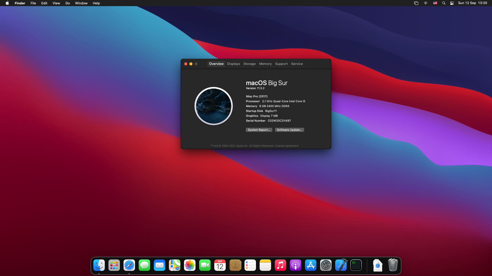

# OpenCore EFI for AMD Laptops (updated to Big Sur 11.5.2)

**OpenCore version: 0.7.4**

**macOS: Big Sur 11.5.2**



My laptop is **ASUS Vivobook A412D**
- CPU: AMD Ryzen 5 3500U
- Display: AMD Radeon Vega 8
- Network: Intel wireless 8265
- Audio: AMD K17.1

**Note**: 
- Please change MLB/ROM/Serial Number/UUID.
- Highly recommend using Wifi by HeliPort app.

There's no audio and video supported, but I mainly use this Hackintosh for iOS development purpose, so not a big deal.

## What's in the box?
```
├── EFI
│   ├── BOOT
│   │   └── BOOTx64.efi
│   └── OC
│       ├── ACPI
│       │   └── SSDT-EC-USBX-DESKTOP.aml
│       ├── Bootstrap
│       │   └── Bootstrap.efi
│       ├── config.plist
│       ├── Drivers
│       │   ├── HfsPlus.efi
│       │   ├── OpenCanopy.efi
│       │   └── OpenRuntime.efi
│       ├── Kexts
│       │   ├── itlwm.kext
│       │   ├── HeliPort.dmg
│       │   ├── AMDRyzenCPUPowerManagement.kext
│       │   ├── AppleALC.kext
│       │   ├── AppleMCEReporterDisabler.kext
│       │   ├── Lilu.kext
│       │   ├── NVMeFix.kext
│       │   ├── SMCAMDProcessor.kext
│       │   ├── VirtualSMC.kext
│       │   ├── VoodooPS2Controller.kext
│       │   └── WhateverGreen.kext
│       ├── OpenCore.efi
│       └── Resources
│           ├── Font
│           ├── Image
│           └── Label

```
## Bonus
